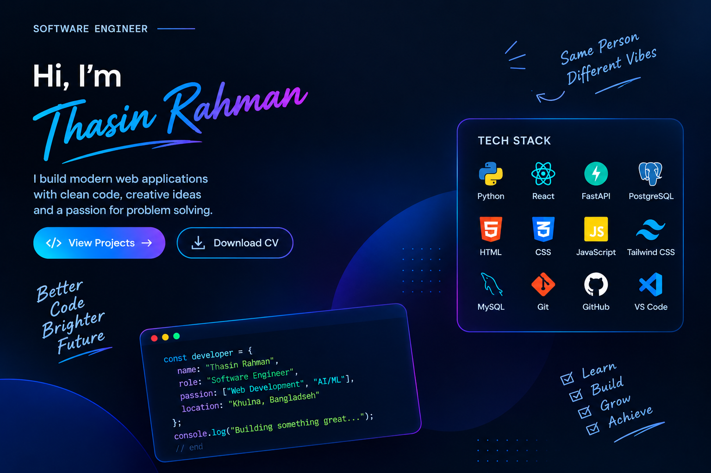

<p align="center">
  
</p>


# 👋 Hi, I'm Sheikh Thasin Rahman Shiplu

### 💻 FastAPI & React.js Developer | CSE Student | Problem Solver

<p align="left">
  <a href="mailto:[sheikhthasinrahman01@gmail.com](mailto:sheikhthasinrahman01@gmail.com)">
    
  </a>
  <a href="https://www.linkedin.com/in/thasin-rahman/">
    
  </a>
  <a href="https://sheikhthasinrahmanprotfolio.netlify.app/">
    
  </a>
</p>

Welcome to my GitHub profile! 👋

I'm an **undergraduate Computer Science & Engineering student** and a passionate **FastAPI & React.js Developer** who enjoys turning ideas into modern, responsive, and user-friendly web applications.

I focus on building practical projects, learning new technologies, solving problems, and continuously improving my development skills.

> 🚀 **Build with purpose. Learn continuously. Improve every day.**

---

## 👨‍💻 About Me

* 🎓 Undergraduate **CSE student**
* 💻 Passionate about **FastAPI & React.js Development**
* ⚛️ Building modern applications with **React**
* 🐍 Developing backend APIs with **Python & FastAPI**
* 🔐 Interested in **Authentication, Authorization & API Security**
* 🗄️ Learning better **Database Design & Backend Architecture**
* 🧠 Practicing **Data Structures & Algorithms**
* 🚀 Interested in **Deployment & Cloud Technologies**
* 🌱 Always learning and experimenting with new technologies

---

## 🛠️ Tech Stack

### 🎨 Frontend

<p align="left">
  
</p>

### ⚙️ Backend

<p align="left">    </p>

### 🗄️ Database & ORM

<p align="left">    </p>

### 💻 Programming Languages

<p align="left">    </p>

### 🔐 Backend & API Skills

<p align="left">
  
  
  
  
</p>

* JWT Authentication
* OAuth2
* Role-Based Access Control
* Password Hashing
* RESTful API Development
* CRUD Operations
* API Validation
* Database Integration

### 🧰 Tools & Platforms

<p align="left">
  
</p>

---

# 🚀 Featured Projects

## 🩸 Blood Donation & Emergency Assistance Platform

A full-stack web application designed to help connect **blood donors and people who need emergency blood assistance**.

### ✨ Highlights

* 🔐 JWT-based authentication
* 👤 User registration & login
* 🛡️ Admin & user role management
* 🩸 Donor management
* 🚨 Emergency blood requests
* 📋 Donation management
* 👤 User profile management
* 🔑 Password management
* 🔒 Bcrypt password hashing
* ⚡ RESTful backend API
* 📱 Responsive React interface
* ☁️ Frontend & backend deployment

### 🧰 Built With

`React` `Vite` `Tailwind CSS` `FastAPI` `SQLAlchemy` `PostgreSQL` `JWT` `Bcrypt`

---

## 📚 Huffman Coding

A C++ implementation of the **Huffman Coding algorithm** for understanding lossless data compression and fundamental data structures.

### ✨ Highlights

* Character & frequency input
* Total frequency calculation
* Huffman Tree construction
* Priority Queue / Min Heap
* Recursive code generation
* Original memory calculation
* Compressed memory calculation
* Memory saving calculation

### 🧰 Built With

`C++` `Data Structures` `Algorithms` `Priority Queue` `Binary Tree`

---

# 🌱 Currently Learning

I'm currently focusing on strengthening my backend and full-stack development skills.

### ⚡ FastAPI & Backend Development

Deepening my understanding of:

* REST API architecture
* SQLAlchemy
* Database design
* JWT authentication
* Authorization & security
* API validation
* Backend deployment

### ⚛️ React & Modern Frontend

Improving my knowledge of:

* Component architecture
* State management
* API integration
* Responsive UI
* Reusable components
* Modern React development

---

# 🧠 Areas of Interest

```text
Full-Stack Development
        ↓
React + Modern UI
        ↓
FastAPI + REST APIs
        ↓
Database & Backend Architecture
        ↓
Authentication & Security
        ↓
Deployment & Cloud
        ↓
Continuous Learning 🚀
```

---

# 📊 GitHub Statistics

<p align="center">
  
  
</p>

---

# 🎯 My Developer Philosophy

> **Learn → Build → Break → Debug → Improve → Repeat 🔄**

I believe real growth comes from **building real projects**, making mistakes, understanding why they happen, and improving with every iteration.

Every project is an opportunity to learn something new. 🚀

---

# 🤝 Let's Connect

I'm always interested in connecting with developers, collaborating on interesting projects, discussing technology, and learning from the developer community.

<p align="center">
  <a href="mailto:[sheikhthasinrahman01@gmail.com](mailto:sheikhthasinrahman01@gmail.com)">
    
  </a>
  <a href="https://www.linkedin.com/in/thasin-rahman/">
    
  </a>
  <a href="https://sheikhthasinrahmanprotfolio.netlify.app/">
    
  </a>
</p>

---

<p align="center">
  <strong>💻 Keep Coding • 🚀 Keep Building • 🌱 Keep Learning</strong>
</p>

<p align="center">
  ⭐ Thanks for visiting my profile!
</p>
